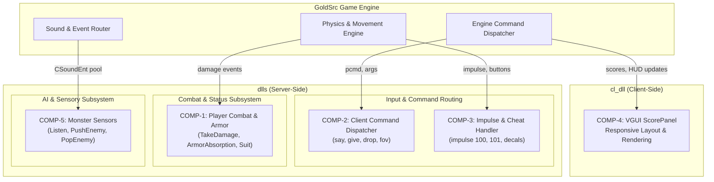

# System Design Document: Code Smell Mitigation

## Overview

This document specifies the technical design for eliminating high-impact code smells across core modules of the Half-Life GoldSrc DLL codebase (`dlls/` and `cl_dll/`). The design focuses on decomposing monolithic routines, eliminating dead code, abstracting repetitive lookups into data-driven tables, and centralizing layout and sensory calculations. All refactorings are strictly non-breaking, behavior-preserving, and guarantee 100% binary and network protocol parity.

---

## System Architecture

### Component Map

| Component ID | Name | Module Path | Type | Responsibility | Interfaces With |
|--------------|------|-------------|------|----------------|-----------------|
| **COMP-1** | Player Combat & Armor Subsystem | `dlls/core/player_combat.cpp` | Core / Server | Manages player damage taking, armor absorption, and HEV suit medical diagnostics | `CBaseMonster`, `CGameRules`, `CSoundEnt` |
| **COMP-2** | Client Command Dispatcher | `dlls/core/client_commands.cpp` | Core / Server | Parses and routes player console commands (`say`, `say_team`, `give`, etc.) | `CBasePlayer`, Engine Callbacks, Unicode Helpers |
| **COMP-3** | Impulse & Cheat Input Handler | `dlls/core/player_input.cpp` | Core / Server | Processes player interaction, impulse commands, and cheat weapon provisioning | `CBasePlayer`, `CItem`, Decal System |
| **COMP-4** | VGUI Scoreboard Layout Engine | `cl_dll/vgui/vgui_ScorePanel.cpp` | UI / Client | Handles scoreboard grid positioning, responsive resolution offsets, and row rendering | `vgui::Panel`, `CSchemeManager`, `CViewPort` |
| **COMP-5** | Monster Sensory & Condition Manager | `dlls/ai/monster_sensors.cpp` | AI / Server | Processes sensory stimuli (audio/visual/smell) and manages monster condition bitmasks | `CSoundEnt`, `CBaseMonster`, `Schedule` |

---

### High-Level Architecture Diagram



---

## Data Flow Specifications

### Flow 1: Damage Processing & Armor Absorption (`COMP-1`)

```
1. [Damage Source] -> CBasePlayer::TakeDamage(pevInflictor, pevAttacker, flDamage, bitsDamageType)
2. TakeDamage -> CGameRules::FPlayerCanTakeDamage (Safety & Teamplay verification)
3. TakeDamage -> ApplyArmorAbsorption(flDamage, bitsDamageType, outFlDamage, outFlArmorDrained)
4. TakeDamage -> pev->armorvalue -= outFlArmorDrained
5. TakeDamage -> CBaseMonster::TakeDamage(..., (int)outFlDamage, bitsDamageType)
6. TakeDamage -> UpdateSuitDiagnosis(bitsDamageType, flHealthPrev)
7. UpdateSuitDiagnosis -> SetSuitUpdate(!HEV_..., FALSE, SUIT_NEXT_IN_...)
```

**Data Transformations:**
- **Step 3:** Given base damage D and damage bits B:
  - If B contains `DMG_FALL` or `DMG_DROWN`, or `pev->armorvalue == 0`, armor absorbs 0.
  - Otherwise, ratio = 0.2, bonus = (multiplayer and blast damage) ? 1.0 : 0.5.
  - Calculated armor drain = (damage - damage * ratio) * bonus.
  - If drain exceeds current armor, capped to available armor and residual damage adjusted: damage = damage - (armorvalue / bonus).
  - Otherwise, damage = damage * ratio, armor -= drain.
- **Step 6:** Suit medical diagnosis replaces unrolled while-loop with clean structured checks per damage category.

---

### Flow 2: Client Command Ingestion (`COMP-2`)

```
1. [Client Engine] -> ClientCommand(edict_t *pEntity)
2. ClientCommand -> Extract CBasePlayer* pointer once
3. ClientCommand -> Lookup command token in command dispatch table
4. ClientCommand -> Execute corresponding specialized handler function
5. Handler -> Apply state changes / Network event serialization
```

**Data Transformations:**
- Eliminates repeated `GetClassPtr((CBasePlayer *)pev)` casts (previously repeated 15+ times across if/else if branches).
- Moves string matching into cohesive local command handler functions (`HandleSay`, `HandleGive`, `HandleDrop`, `HandleFov`).

---

### Flow 3: Impulse 101 Cheat Provisioning (`COMP-3`)

```
1. [Player Button/Console] -> CBasePlayer::ImpulseCommands()
2. ImpulseCommands -> CBasePlayer::CheatImpulseCommands(iImpulse = 101)
3. CheatImpulseCommands -> Iterate over static struct array g_Impulse101Items[]
4. Table Iterator -> CBasePlayer::GiveNamedItem(item_name)
```

**Data Transformations:**
- Replaces 30+ sequential unrolled `GiveNamedItem` calls with a static constant array traversal:
  ```cpp
  static const char * const s_szImpulse101Items[] = {
      "item_suit", "item_battery", "weapon_crowbar", "weapon_9mmhandgun",
      "ammo_9mmclip", "weapon_shotgun", "ammo_buckshot", ...
  };
  ```
- Retains identical item addition sequence and inventory allocation.

---

### Flow 4: Monster Audio Sensing & Condition Reset (`COMP-5`)

```
1. [AI Scheduler] -> CBaseMonster::Listen()
2. Listen -> Reset condition bits ONCE: ClearConditions(bits_COND_HEAR_SOUND | bits_COND_SMELL | bits_COND_SMELL_FOOD)
3. Listen -> CSoundEnt::ActiveList() traversal
4. Listen -> For each sound: distance check vs hearingSensitivity
5. Listen -> Mark heard conditions and append to audible list
```

**Data Transformations:**
- Consolidates duplicated `ClearConditions` calls into a single invocation at the beginning of `Listen()`.
- Purges commented-out raw pool references `g_pSoundEnt->m_SoundPool`.

---

## Integration Points

### Internal Integration Points

| Source Component | Target Component | Mechanism | Data Format | Responsibility |
|------------------|------------------|-----------|-------------|----------------|
| `dlls/core/player.cpp` | `COMP-1` | Virtual Method Call | Member parameters | Calls `TakeDamage`, passes inflictor, attacker, damage |
| `dlls/core/client.cpp` | `COMP-2` | Engine C-Hook | `edict_t *pEntity` | Routes user command strings from network buffer |
| `COMP-3` | `dlls/weapons/*` | Method Invocation | Item classnames (`const char *`) | Spawns and attaches weapons to player inventory |
| `COMP-4` | `cl_dll/vgui/*` | VGUI Event Pipeline | Screen coordinates / Pixels | Formats and paints scoreboard grid |
| `dlls/ai/*` | `COMP-5` | AI Think Cycle | Bitmasks / Sound indices | Scans world sounds and triggers reactions |

---

## Components and Interfaces

### COMP-1: Player Combat & Armor Subsystem

- **File**: `dlls/core/player_combat.cpp`
- **Responsibilities**:
  - Encapsulate armor absorption logic into a private helper function.
  - Simplify suit warning diagnostics using mapped sentence tables.
  - Remove dead `#if 0` blocks (`ThrowGib`, `ThrowHead`).
- **Interface Contract**:
  ```cpp
  // Helper for armor absorption calculation
  void CalculateArmorAbsorption(
      float flDamage,
      int bitsDamageType,
      float flCurrentArmor,
      BOOL bIsMultiplayer,
      float &flDamageOut,
      float &flArmorDrainedOut
  );
  ```

---

### COMP-2: Client Command Dispatcher

- **File**: `dlls/core/client_commands.cpp`
- **Responsibilities**:
  - Resolve `CBasePlayer` once per command.
  - Extract UTF-8 helper functions into a clean utility section or common header.
  - Structure command routing to eliminate deep ladder nesting.
- **Interface Contract**:
  ```cpp
  void ClientCommand( edict_t *pEntity );
  // Static command dispatch handlers
  static void Cmd_Say( CBasePlayer *pPlayer, edict_t *pEntity, BOOL bTeamOnly );
  static void Cmd_FullUpdate( CBasePlayer *pPlayer );
  static void Cmd_Give( CBasePlayer *pPlayer );
  static void Cmd_Drop( CBasePlayer *pPlayer );
  static void Cmd_Fov( CBasePlayer *pPlayer );
  ```

---

### COMP-3: Impulse & Cheat Input Handler

- **File**: `dlls/core/player_input.cpp`
- **Responsibilities**:
  - Replace unrolled impulse 101 item provisioning with a static data table.
  - Remove obsolete pre-alpha comments and unused variables.
- **Interface Contract**:
  ```cpp
  void CBasePlayer::ImpulseCommands();
  void CBasePlayer::CheatImpulseCommands( int iImpulse );
  ```

---

### COMP-4: VGUI Scoreboard Layout Engine

- **File**: `cl_dll/vgui/vgui_ScorePanel.cpp`
- **Responsibilities**:
  - Replace magic screen resolution literals (`ScreenWidth >= 640`, `ScreenWidth == 400`) with named layout constants.
  - Remove dead commented-out graphics loading calls.
- **Interface Contract**:
  ```cpp
  // Constants for layout thresholds
  constexpr int RES_LOW_WIDTH = 400;
  constexpr int RES_DEFAULT_WIDTH = 640;
  ```

---

### COMP-5: Monster Sensory & Condition Manager

- **File**: `dlls/ai/monster_sensors.cpp`
- **Responsibilities**:
  - Eliminate duplicate `ClearConditions` calls.
  - Purge dead commented-out sound pool references.
  - Document and streamline `PushEnemy` and `PopEnemy` memory arrays.
- **Interface Contract**:
  ```cpp
  void CBaseMonster::Listen();
  void CBaseMonster::PushEnemy( CBaseEntity *pEnemy, Vector &vecLastKnownPos );
  BOOL CBaseMonster::PopEnemy();
  ```

---

## Error Handling & Defensive Boundaries

1. **Null Entity Protection**: All commands and damage routines verify `!FNullEnt(pev)` and `!FNullEnt(pEntity)` before dereferencing private data.
2. **Bounds Enforcement**:
   - `PopEnemy` and `PushEnemy` strictly enforce index bounds between `0` and `MAX_OLD_ENEMIES - 1`.
   - Table iteration for `s_szImpulse101Items` bounded by `ARRAYSIZE(s_szImpulse101Items)`.
3. **Save/Restore Integrity**: No alterations to class memory layouts or `TYPEDESCRIPTION` tables.

---

## Testing & Verification Strategy

### 1. Static Analysis & Debt Verification
- Run `debt_scanner.py` against modified files before and after changes.
- Verify decrease in code smell counts and ensure zero new warnings or issues introduced.

### 2. Compilation Verification
- Build `hldll.vcxproj` (server DLL) and `hl_cdll.vcxproj` (client DLL) with MSBuild v145.
- Require: **0 errors, 0 warnings**.

### 3. Functional Equivalence Audit
- Compare generated assembly or logical step traces for `ApplyArmorAbsorption` vs original math.
- Verify impulse 101 item lists match byte-for-byte in count and string contents.
- Verify that `ClearConditions` behavior in `Listen()` remains identical.
