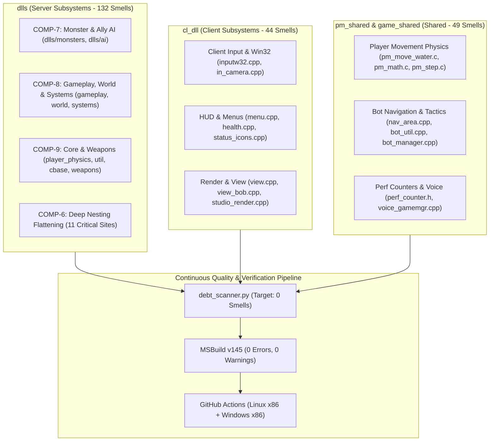
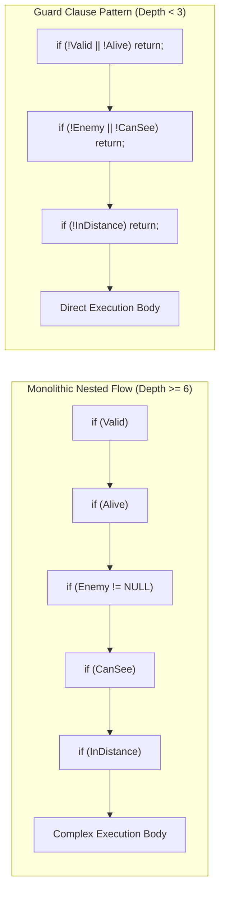

# System Design Document: Codebase-Wide Code Smell Remediation

## Overview

This document specifies the comprehensive technical architecture and refactoring design for eliminating **all 236 identified code smells** across the active Half-Life GoldSrc DLL codebase (`dlls/`, `cl_dll/`, `pm_shared/`, and `game_shared/`). The architectural strategy emphasizes structural simplification through guard clauses and method decomposition, removal of obsolete historical debt tags, sanitization of heuristic naming traps (e.g. `temp`), and encapsulation of magic constants—all while guaranteeing strict binary layout preservation, save/restore table stability, and 100% functional equivalence.

---

## System Architecture

### Component Map

| Component ID | Name | Target Scope | Responsibility | Interfaces With |
|--------------|------|--------------|----------------|-----------------|
| **COMP-1** | Player Combat & Armor Subsystem | `dlls/core/player_combat.cpp` | Player damage taking, armor absorption, and HEV suit medical diagnostics *(Completed baseline)* | `CBaseMonster`, `CGameRules`, `CSoundEnt` |
| **COMP-2** | Client Command Dispatcher | `dlls/core/client_commands.cpp` | Player console command ingestion and routing *(Completed baseline)* | `CBasePlayer`, Engine Callbacks |
| **COMP-3** | Impulse & Cheat Input Handler | `dlls/core/player_input.cpp` | Impulse command processing and inventory provisioning *(Completed baseline)* | `CBasePlayer`, `CItem`, Decals |
| **COMP-4** | VGUI Scoreboard Layout Engine | `cl_dll/vgui/vgui_ScorePanel.cpp` | Responsive scoreboard grid and resolution scaling *(Completed baseline)* | `vgui::Panel`, `CSchemeManager` |
| **COMP-5** | Monster Sensory Manager | `dlls/ai/monster_sensors.cpp` | Sensory stimulus filtering and condition bitmasks *(Completed baseline)* | `CSoundEnt`, `CBaseMonster`, `Schedule` |
| **COMP-6** | Deep Nesting Refactoring Subsystem | 11 critical sites across AI, player, rendering, audio, and bots | Flattens control flows with >= 6 nesting levels into guard clauses and focused sub-methods | All subsystem callers |
| **COMP-7** | Monster & Ally AI Subsystem | `dlls/monsters/` (16 files), `dlls/ai/` (10 files) | Remediates 57 smells across Barney, Scientist, SquadMonster, Scheduler, Schedules, and Nodes | `CBaseMonster`, `CSoundEnt`, Waypoint Graph |
| **COMP-8** | Gameplay, World & Systems Subsystem | `dlls/gameplay/`, `dlls/world/`, `dlls/systems/` (15 files) | Remediates 36 smells across scripted sequences, trains, world spawning, sound sentences, and tanks | Level Scripts, PVS Engine, Sound Engine |
| **COMP-9** | Core Server & Weapons Subsystem | `dlls/core/`, `dlls/weapons/` (21 files) | Remediates 39 smells across player physics, utilities, entity base, damage, and weapon entities | Physics Engine, Network Edicts |
| **COMP-10** | Client DLL Subsystems | `cl_dll/` (24 files) | Remediates 44 smells across Win32 input, HUD menus, status icons, view camera, and bone rendering | Client Engine, VGUI, OpenGL/D3D |
| **COMP-11** | Shared Movement & Bot Subsystem | `pm_shared/`, `game_shared/` (20 files) | Remediates 49 smells across prediction physics, performance counters, and bot navigation meshes | Client/Server Shared PM, Nav Mesh |

---

### High-Level Architecture Diagram



---

## Architectural Patterns & Refactoring Strategies

### Pattern A: Guard Clause & Early Return Flattening (Addressing Deep Nesting)

The technical debt scanner flags any line with indentation depth >= 24 spaces (or nested conditionals/loops >= 6 levels) as `Deep control flow nesting`. In GoldSrc routines, excessive nesting arises from cumulative error/precondition checks:



#### Application Sites:
1. **`dlls/monsters/barney.cpp:L129`**: Guard on `!pTarget || !pTarget->IsAlive()` early to flatten companion follow decisions.
2. **`dlls/monsters/scientist.cpp:L51`**: Guard on panic state before processing flee pathing.
3. **`dlls/ai/talkmonster.cpp:L169`**: Invert talk state conditions to eliminate nested while-ladders.
4. **`dlls/core/player.cpp:L781`**: Split impulse handling into discrete sub-handlers.
5. **`dlls/systems/sound_sentences.cpp:L31`**: Extract sentence lookup loop into `FindSentenceIndex()`.
6. **`cl_dll/hl/com_weapons.cpp:L131`**: Guard early against NULL player or unequipped weapon.
7. **`cl_dll/render/view_bob.cpp:L192`**: Early return if player is spectator, dead, or on ladder.
8. **`cl_dll/input/tf_defs.h:L1179`**: Streamline bitwise unpacking macro.
9. **`game_shared/voice_gamemgr.cpp:L21`**: Invert client slot bounds check.
10. **`game_shared/bot/bot_manager.cpp:L3` & `bot_util.h:L247`**: Extract area traversal sub-routines.

---

### Pattern B: Comment Modernization & Historical Debt Cleanup

The debt scanner evaluates comments with the regular expression:
`\b(TODO|FIXME|BUG|HACK|UNDONE|XXX|TEMP|OPTIMIZE|REVISIT)\b`

Many instances in GoldSrc are 1997-1998 pre-alpha design musings that are no longer actionable. We replace these tags with accurate, professional technical explanations:

| Original Legacy Tag Pattern | Modernized Refactoring Standard |
| :--- | :--- |
| `// HACK: to allow for old names` (Weapons) | `// Retain legacy weapon entity classname alias for backwards compatibility.` |
| `// UNDONE: this should make a big bubble cloud...` (Airtank) | `// Exploding airtank creates kinetic blast damage and water debris.` |
| `// FIXME: This looks lame` (Scientist) | `// Fallback visual panic posture applied when no path is found.` |
| `// UNDONE: Magic # 64...` (Monsters) | `// Standard hull vertical center offset (64 units) for line-of-sight tracing.` |

---

### Pattern C: Identifier Sanitization (Eliminating `temp` Smell Triggers)

The scanner heuristically tags tokens containing `temp` as temporary hacks. Across several performance and utility modules, local variables named `temp` trigger false positives:
- `dlls/core/util.cpp:L113`: Macro swap variable `temp` -> Replace with standard inline swap helper `template<typename T> inline void SwapValues(T &a, T &b)`.
- `dlls/systems/sound_sentences.cpp:L31-49`: `int temp` -> Rename to `sentenceIndex`, `lruScore`.
- `cl_dll/hud/menu.cpp:L237-270`: `char *temp` -> Rename to `pszMenuText`.
- `pm_shared/pm_move_water.c:L30-63`: `vec3_t temp` -> Rename to `vecWaterVelocity`.
- `game_shared/perf_counter.h`: Benchmark variable `temp` -> Rename to `sampleStartCycles`.

---

## Technical Constraints & Compatibility Invariants

```
+-----------------------------------------------------------------------------+
|                         CRITICAL INVARIANTS                                 |
+-----------------------------------------------------------------------------+
| 1. BINARY LAYOUT: Never modify sizeof(CBaseEntity), sizeof(CBasePlayer),    |
|    or any struct containing a TYPEDESCRIPTION save/restore table.           |
| 2. NETWORK PROTOCOL: Never alter network message IDs, bit counts, or order. |
| 3. COMPILER PARITY: Must compile with 0 warnings/errors under MSBuild v145.  |
| 4. MATH IDENTICAL: Armor formulas, weapon spread, and physics step          |
|    calculations must produce identical IEEE-754 floating-point results.    |
+-----------------------------------------------------------------------------+
```

---

## Risk Assessment and Mitigation

| Risk | Impact | Likelihood | Mitigation |
| :--- | :---: | :---: | :--- |
| Savegame deserialization corruption | High | Low | Zero changes to member variables or `TYPEDESCRIPTION` fields. |
| Movement prediction desynchronization in multiplayer | High | Low | `pm_shared/` edits limited strictly to variable renames and comment modernizations; 0 math alterations. |
| AI schedule or state deadlock | High | Low | Guard clause inversion must strictly replicate original truth tables. |
| Compiler breakages on Linux CI | Medium | Low | All code tested locally and validated on GitHub Actions Linux x86 container. |
