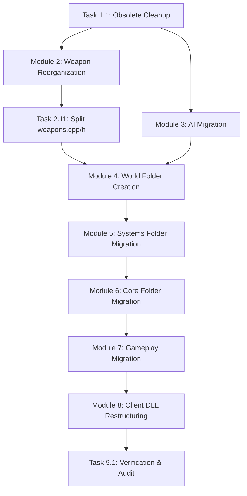

# Action Plan: GoldSrc SDK Reorganization & Refactoring (Phase 2)

This document provides a highly granular, step-by-step action plan to finalize the behavior-preserving refactoring of the Half-Life GoldSrc codebase. The goal is to finish moving the remaining source files from the flat roots of `dlls/` and `cl_dll/` into domain-specific subdirectories, resolve code bloat, delete obsolete files, update build files, and facilitate modern parallelized development.

---

## 1. Architectural Blueprint & Target Paths

The tables below map the remaining files in the root of `dlls/` and `cl_dll/` to their target directories:

### 1.1 `dlls/` Root Migration Map

| Source File | Proposed Target Path | Domain/Sub-system | Action Required |
| :--- | :--- | :--- | :--- |
| **`AI_BaseNPC_Schedule.cpp`** | None | AI / Leftover | **Delete** (Obsolete duplicate of `dlls/ai/schedule.cpp`) |
| **`glock.cpp`** | None | Weapons / Leftover | **Delete** (Obsolete duplicate of `dlls/wpn_shared/hl_wpn_glock.cpp`) |
| **`triggers.cpp`** | None | Systems / Leftover | **Delete** (Obsolete duplicate, already split into `dlls/systems/trigger_*`) |
| **`wpn_shared/hl_wpn_glock.cpp`** | `dlls/weapons/weapon_glock.cpp` | Weapons / Glock | Move, create header, remove from `weapons.h`, update build files. |
| **`crossbow.cpp`** | `dlls/weapons/weapon_crossbow.cpp` | Weapons / Crossbow | Move, create header, remove from `weapons.h`, update build files. |
| **`crowbar.cpp`** | `dlls/weapons/weapon_crowbar.cpp` | Weapons / Crowbar | Move, create header, remove from `weapons.h`, update build files. |
| **`python.cpp`** | `dlls/weapons/weapon_python.cpp` | Weapons / Python 357 | Move, create header, remove from `weapons.h`, update build files. |
| **`mp5.cpp`** | `dlls/weapons/weapon_mp5.cpp` | Weapons / MP5 Submachine Gun | Move, create header, remove from `weapons.h`, update build files. |
| **`hornetgun.cpp`** | `dlls/weapons/weapon_hornetgun.cpp` | Weapons / Hivehand (Hornet Gun) | Move, create header, remove from `weapons.h`, update build files. |
| **`hornet.cpp` / `hornet.h`** | `dlls/weapons/projectile_hornet.cpp` / `.h` | Weapons / Hornet projectile | Move & rename, update build files. |
| **`handgrenade.cpp`** | `dlls/weapons/weapon_handgrenade.cpp` | Weapons / Handgrenade | Move, create header, remove from `weapons.h`, update build files. |
| **`tripmine.cpp`** | `dlls/weapons/weapon_tripmine.cpp` | Weapons / Laser Tripmine | Move, create header, remove from `weapons.h`, update build files. |
| **`squeakgrenade.cpp`** | `dlls/weapons/weapon_snark.cpp` | Weapons / Snark | Move, create header, remove from `weapons.h`, update build files. |
| **`ggrenade.cpp`** | `dlls/weapons/projectile_grenade.cpp` | Weapons / Grenade projectile | Move, create header, update build files. |
| **`weapons.cpp` / `weapons.h`** | `dlls/weapons/weapon_base.cpp` / `.h` | Weapons / Base helpers | Relocate remaining functions (precache, multidamage) and macros; delete root files. |
| **`basemonster.h`** | `dlls/ai/basemonster.h` | AI / Base Monster Class | Move and update all includes across the codebase. |
| **`flyingmonster.cpp` / `.h`** | `dlls/ai/flyingmonster.cpp` / `.h` | AI / Flying Monster Base | Move and update includes / build files. |
| **`talkmonster.cpp` / `.h`** | `dlls/ai/talkmonster.cpp` / `.h` | AI / Talking NPC Base | Move and update includes / build files. |
| **`h_ai.cpp`** | `dlls/ai/h_ai.cpp` | AI / Helpers | Move and update includes / build files. |
| **`monsterstate.cpp`** | `dlls/ai/monsterstate.cpp` | AI / State Machine | Move and update includes / build files. |
| **`monstermaker.cpp`** | `dlls/ai/monstermaker.cpp` | AI / Spawner Entity | Move and update includes / build files. |
| **`playermonster.cpp`** | `dlls/ai/playermonster.cpp` | AI / Player Interactions | Move and update includes / build files. |
| **`tempmonster.cpp`** | `dlls/ai/tempmonster.cpp` | AI / Temporary Entities | Move and update includes / build files. |
| **`soundent.cpp` / `.h`** | `dlls/ai/soundent.cpp` / `.h` | AI / Sound Listener | Move and update includes / build files. |
| **`activity.h` / `activitymap.h`** | `dlls/ai/activity.h` / `activitymap.h` | AI / Enums & Structures | Move and update includes / build files. |
| **`monsterevent.h`** | `dlls/ai/monsterevent.h` | AI / Event Constants | Move and update includes / build files. |
| **`squad.h`** | `dlls/ai/squad.h` | AI / Squad Headers | Move and update includes / build files. |
| **`pathcorner.cpp`** | `dlls/ai/pathcorner.cpp` | AI / Navigation Node | Move and update includes / build files. |
| **`bmodels.cpp`** | `dlls/world/bmodels.cpp` | World / Brush Entities | Create `dlls/world/` folder and move file. |
| **`world.cpp`** | `dlls/world/world.cpp` | World / Worldspawn Entity | Move file. |
| **`plats.cpp`** | `dlls/world/plats.cpp` | World / Platforms & Trains | Move file. |
| **`trains.h`** | `dlls/world/trains.h` | World / Trains Header | Move file. |
| **`xen.cpp`** | `dlls/world/xen.cpp` | World / Xen World Entities | Move file (xen environmental logic). |
| **`buttons.cpp`** | `dlls/systems/buttons.cpp` | Systems / Usable Buttons | Move to systems directory. |
| **`doors.cpp` / `.h`** | `dlls/systems/doors.cpp` / `.h` | Systems / Interactive Doors | Move to systems directory. |
| **`effects.cpp` / `.h`** | `dlls/systems/effects.cpp` / `.h` | Systems / Special Effects | Move to systems directory. |
| **`explode.cpp` / `.h`** | `dlls/systems/explode.cpp` / `.h` | Systems / Explosions | Move to systems directory. |
| **`func_break.cpp` / `.h`** | `dlls/systems/func_break.cpp` / `.h` | Systems / Breakables | Move to systems directory. |
| **`lights.cpp`** | `dlls/systems/lights.cpp` | Systems / Lighting Entities | Move to systems directory. |
| **`sound.cpp`** | `dlls/systems/sound.cpp` | Systems / Sound Entities | Move to systems directory. |
| **`airtank.cpp`** | `dlls/systems/airtank.cpp` | Systems / Usable Air Tank | Move to systems directory. |
| **`h_battery.cpp`** | `dlls/systems/h_battery.cpp` | Systems / HEV Wall Charger | Move to systems directory. |
| **`healthkit.cpp`** | `dlls/systems/healthkit.cpp` | Systems / Health Wall Charger | Move to systems directory. |
| **`h_cycler.cpp`** | `dlls/systems/h_cycler.cpp` | Systems / Cycler Entities | Move to systems directory. |
| **`mortar.cpp`** | `dlls/systems/mortar.cpp` | Systems / Mortar Systems | Move to systems directory. |
| **`vehicle.cpp`** | `dlls/systems/vehicle.cpp` | Systems / Usable Vehicles | Move to systems directory. |
| **`animating.cpp`** | `dlls/core/animating.cpp` | Core / Base Classes | Move to core directory. |
| **`animation.cpp` / `.h`** | `dlls/core/animation.cpp` / `.h` | Core / Animation Utilities | Move to core directory. |
| **`h_export.cpp`** | `dlls/core/h_export.cpp` | Core / DLL Entry Point | Move to core directory. |
| **`plane.cpp` / `.h`** | `dlls/core/plane.cpp` / `.h` | Core / Math Helper | Move to core directory. |
| **`player.h`** | `dlls/core/player.h` | Core / Player Header | Move to core directory (matches `player.cpp`). |
| **`skill.cpp` / `.h`** | `dlls/core/skill.cpp` / `.h` | Core / Difficulty Settings | Move to core directory. |
| **`subs.cpp`** | `dlls/core/subs.cpp` | Core / Base Entity Callbacks | Move to core directory. |
| **`game.cpp` / `.h`** | `dlls/core/game.cpp` / `.h` | Core / Game Rules Init | Move to core directory. |
| **`client.cpp` / `.h`** | `dlls/core/client.cpp` / `.h` | Core / Client Bindings | Move to core directory. |
| **`combat.cpp`** | `dlls/core/combat.cpp` | Core / Attack & Damage logic | Move to core directory (houses `CGib` class). |
| **`decals.h`** | `dlls/core/decals.h` | Core / Decal Definitions | Move to core directory. |
| **`Wxdebug.cpp` / `wxdebug.h`** | `dlls/core/wxdebug.cpp` / `.h` | Core / Debug Utilities | Move to core directory. |
| **`mpstubb.cpp`** | `dlls/core/mpstubb.cpp` | Core / MP Stubs | Move to core directory. |
| **`h_cine.cpp`** | `dlls/gameplay/h_cine.cpp` | Gameplay / Cinematic Logic | Move to gameplay directory. |
| **`observer.cpp`** | `dlls/gameplay/observer.cpp` | Gameplay / Observer Mode | Move to gameplay directory. |
| **`spectator.cpp` / `.h`** | `dlls/gameplay/spectator.cpp` / `.h` | Gameplay / Spectator Mode | Move to gameplay directory. |
| **`stats.cpp`** | `dlls/gameplay/stats.cpp` | Gameplay / Game Stats | Move to gameplay directory. |

---

### 1.2 `cl_dll/` Root Migration Map

| Group Folder | Source Files | Target Directory | Action Required |
| :--- | :--- | :--- | :--- |
| **VGUI Subsystem** | `vgui_ClassMenu.cpp`, `vgui_ConsolePanel.cpp` / `.h`, `vgui_ControlConfigPanel.cpp` / `.h`, `vgui_CustomObjects.cpp`, `vgui_MOTDWindow.cpp`, `vgui_SchemeManager.cpp` / `.h`, `vgui_ScorePanel.cpp` / `.h`, `vgui_ServerBrowser.cpp` / `.h`, `vgui_SpectatorPanel.cpp` / `.h`, `vgui_TeamFortressViewport.cpp` / `.h`, `vgui_int.cpp` / `.h`, `vgui_teammenu.cpp`, `MOTD.cpp` | `cl_dll/vgui/` | Create directory, migrate files, update include paths, and update `hl_cdll.vcxproj` and `Makefile`. |
| **HUD Subsystem** | `hud.cpp` / `.h`, `hud_bench.cpp`, `hud_benchtrace.cpp` / `.h`, `hud_msg.cpp`, `hud_redraw.cpp`, `hud_servers.cpp` / `.h`, `hud_servers_priv.h`, `hud_spectator.cpp` / `.h`, `hud_update.cpp`, `battery.cpp`, `flashlight.cpp`, `geiger.cpp`, `health.cpp` / `.h`, `ammo.cpp` / `.h`, `ammo_secondary.cpp`, `ammohistory.cpp` / `.h`, `saytext.cpp`, `scoreboard.cpp`, `statusbar.cpp`, `status_icons.cpp`, `menu.cpp`, `message.cpp`, `text_message.cpp`, `train.cpp`, `death.cpp`, `voice_status.cpp` / `.h` | `cl_dll/hud/` | Create directory, migrate files, update include paths, and update `hl_cdll.vcxproj` and `Makefile`. |
| **Studio Renderer** | `GameStudioModelRenderer.cpp` / `.h`, `GameStudioModelRenderer_Sample.cpp` / `.h`, `StudioModelRenderer.cpp` / `.h`, `studio_util.cpp` / `.h` | `cl_dll/studio/` | Create directory, migrate files, update include paths, and update `hl_cdll.vcxproj` and `Makefile`. |
| **Input Subsystem** | `in_camera.cpp`, `input.cpp`, `inputw32.cpp` | `cl_dll/input/` | Create directory, migrate files, update include paths, and update `hl_cdll.vcxproj` and `Makefile`. |

---

## 2. Dependency Graph

The refactoring tasks must follow this execution order to minimize compilation breakages:



---

## 3. Detailed Action Tasks & Prompts

### Module 1: Obsolete Files Cleanup

#### Task 1.1 — Delete Leftover Source Files
* **Context**: Leftover duplicate files are sitting in the `dlls/` root and are not listed in the build files (`Makefile`, `hldll.vcxproj`). Deleting them avoids confusion and prevents accidental edits.
* **Dependencies**: None
* **Actionable Prompt**:
  ```text
  Delete the following obsolete files in the 'dlls/' root directory:
  - 'dlls/AI_BaseNPC_Schedule.cpp' (duplicate of 'dlls/ai/schedule.cpp')
  - 'dlls/glock.cpp' (duplicate of 'dlls/wpn_shared/hl_wpn_glock.cpp')
  - 'dlls/triggers.cpp' (duplicate of individual files in 'dlls/systems/trigger_*')
  Ensure that they are not referenced in the project build configuration.
  ```
* **Expected Verification**: The files are deleted, and compilation still succeeds.

---

### Module 2: Weapon Reorganization

Weapons must be moved into `dlls/weapons/`. Since several weapon classes are declared in the single massive header `dlls/weapons.h`, we will extract each weapon class into its own header (`weapon_<name>.h`) and move the corresponding source file.

#### Task 2.1 — Refactor Glock Weapon
* **Context**: The Glock uses predicted multiplayer code in `dlls/wpn_shared/hl_wpn_glock.cpp`. We want to move it to `dlls/weapons/weapon_glock.cpp` and create a dedicated header.
* **Dependencies**: Task 1.1
* **Actionable Prompt**:
  ```text
  1. Create the header file 'dlls/weapons/weapon_glock.h'.
  2. Extract the 'CGlock' and 'CGlockAmmo' class declarations from 'dlls/weapons.h' and place them in 'dlls/weapons/weapon_glock.h'.
  3. Relocate 'dlls/wpn_shared/hl_wpn_glock.cpp' to 'dlls/weapons/weapon_glock.cpp'. Update its includes to reference 'weapons/weapon_glock.h'. Remove the 'wpn_shared/' folder if empty.
  4. Update include paths inside 'cl_dll/hl/hl_weapons.cpp' to include 'weapons/weapon_glock.h'.
  5. Update 'dlls/Makefile', 'projects/vs2019/hldll.vcxproj', and 'projects/vs2019/hl_cdll.vcxproj' (and their respective filter files) to compile the moved file from its new path.
  ```

#### Task 2.2 — Refactor Crowbar Weapon
* **Context**: Relocate the crowbar weapon to the modular directory.
* **Dependencies**: Task 1.1
* **Actionable Prompt**:
  ```text
  1. Create the header file 'dlls/weapons/weapon_crowbar.h'.
  2. Extract the 'CCrowbar' class declaration from 'dlls/weapons.h' and place it in 'dlls/weapons/weapon_crowbar.h'.
  3. Relocate 'dlls/crowbar.cpp' to 'dlls/weapons/weapon_crowbar.cpp' and include 'weapons/weapon_crowbar.h'.
  4. Update include paths inside 'cl_dll/hl/hl_weapons.cpp' to include 'weapons/weapon_crowbar.h'.
  5. Update 'dlls/Makefile', 'projects/vs2019/hldll.vcxproj', and 'projects/vs2019/hl_cdll.vcxproj' (and their respective filters) to point to the new files.
  ```

#### Task 2.3 — Refactor Python (357 Magnum) Weapon
* **Dependencies**: Task 1.1
* **Actionable Prompt**:
  ```text
  1. Create the header file 'dlls/weapons/weapon_python.h'.
  2. Extract the 'CPython' and 'CPythonAmmo' (if any) class declarations from 'dlls/weapons.h' and place them in 'dlls/weapons/weapon_python.h'.
  3. Relocate 'dlls/python.cpp' to 'dlls/weapons/weapon_python.cpp' and include 'weapons/weapon_python.h'.
  4. Update includes inside 'cl_dll/hl/hl_weapons.cpp'.
  5. Update 'dlls/Makefile', 'projects/vs2019/hldll.vcxproj', and 'projects/vs2019/hl_cdll.vcxproj' compilation paths.
  ```

#### Task 2.4 — Refactor MP5 Submachine Gun
* **Dependencies**: Task 1.1
* **Actionable Prompt**:
  ```text
  1. Create the header 'dlls/weapons/weapon_mp5.h'.
  2. Move 'CMP5' and related ammo class declarations from 'dlls/weapons.h' to 'dlls/weapons/weapon_mp5.h'.
  3. Relocate 'dlls/mp5.cpp' to 'dlls/weapons/weapon_mp5.cpp'. Include 'weapons/weapon_mp5.h'.
  4. Update client weapons include and compilation in 'cl_dll/hl/hl_weapons.cpp'.
  5. Update compilation entries in 'dlls/Makefile', 'projects/vs2019/hldll.vcxproj', and 'projects/vs2019/hl_cdll.vcxproj'.
  ```

#### Task 2.5 — Refactor Crossbow Weapon
* **Dependencies**: Task 1.1
* **Actionable Prompt**:
  ```text
  1. Create 'dlls/weapons/weapon_crossbow.h'.
  2. Extract the 'CCrossbow' and bolt/ammo declarations from 'dlls/weapons.h' and place them in 'dlls/weapons/weapon_crossbow.h'.
  3. Relocate 'dlls/crossbow.cpp' to 'dlls/weapons/weapon_crossbow.cpp'. Include 'weapons/weapon_crossbow.h'.
  4. Update includes in 'cl_dll/hl/hl_weapons.cpp'.
  5. Update build configurations ('Makefile', 'hldll.vcxproj', 'hl_cdll.vcxproj').
  ```

#### Task 2.6 — Refactor Hornet Gun (Hivehand)
* **Dependencies**: Task 1.1
* **Actionable Prompt**:
  ```text
  1. Create 'dlls/weapons/weapon_hornetgun.h'.
  2. Extract 'CHgun' class declaration from 'dlls/weapons.h' into 'dlls/weapons/weapon_hornetgun.h'.
  3. Relocate 'dlls/hornetgun.cpp' to 'dlls/weapons/weapon_hornetgun.cpp' and include 'weapons/weapon_hornetgun.h'.
  4. Move 'dlls/hornet.cpp' and 'dlls/hornet.h' to 'dlls/weapons/projectile_hornet.cpp' and 'dlls/weapons/projectile_hornet.h'. Update paths inside them.
  5. Update includes in 'cl_dll/hl/hl_weapons.cpp'.
  6. Update 'Makefile', 'hldll.vcxproj', and 'hl_cdll.vcxproj' paths.
  ```

#### Task 2.7 — Refactor Handgrenade Weapon
* **Dependencies**: Task 1.1
* **Actionable Prompt**:
  ```text
  1. Create 'dlls/weapons/weapon_handgrenade.h'.
  2. Move 'CHandGrenade' class declaration from 'dlls/weapons.h' to 'dlls/weapons/weapon_handgrenade.h'.
  3. Relocate 'dlls/handgrenade.cpp' to 'dlls/weapons/weapon_handgrenade.cpp' and include 'weapons/weapon_handgrenade.h'.
  4. Update include paths inside 'cl_dll/hl/hl_weapons.cpp' to include 'weapons/weapon_handgrenade.h'.
  5. Update compilation entries in 'dlls/Makefile', 'hldll.vcxproj', and 'hl_cdll.vcxproj'.
  ```

#### Task 2.8 — Refactor Tripmine Weapon
* **Dependencies**: Task 1.1
* **Actionable Prompt**:
  ```text
  1. Create 'dlls/weapons/weapon_tripmine.h'.
  2. Move 'CTripmine' class declaration from 'dlls/weapons.h' to 'dlls/weapons/weapon_tripmine.h'.
  3. Relocate 'dlls/tripmine.cpp' to 'dlls/weapons/weapon_tripmine.cpp' and include 'weapons/weapon_tripmine.h'.
  4. Update includes in 'cl_dll/hl/hl_weapons.cpp'.
  5. Update compilation entries in 'dlls/Makefile', 'hldll.vcxproj', and 'hl_cdll.vcxproj'.
  ```

#### Task 2.9 — Refactor Snark (Squeak Grenade) Weapon
* **Dependencies**: Task 1.1
* **Actionable Prompt**:
  ```text
  1. Create 'dlls/weapons/weapon_snark.h'.
  2. Move 'CSqueak' class declaration from 'dlls/weapons.h' to 'dlls/weapons/weapon_snark.h'.
  3. Relocate 'dlls/squeakgrenade.cpp' to 'dlls/weapons/weapon_snark.cpp' and include 'weapons/weapon_snark.h'.
  4. Update includes in 'cl_dll/hl/hl_weapons.cpp'.
  5. Update compilation entries in 'dlls/Makefile', 'hldll.vcxproj', and 'hl_cdll.vcxproj'.
  ```

#### Task 2.10 — Relocate Grenade Projectiles
* **Dependencies**: Task 1.1
* **Actionable Prompt**:
  ```text
  1. Relocate 'dlls/ggrenade.cpp' to 'dlls/weapons/projectile_grenade.cpp'.
  2. Create a header 'dlls/weapons/projectile_grenade.h' containing the 'CGrenade' class declaration (if it was defined inside ggrenade.cpp or weapons.h). Include it.
  3. Update build file compilation entries ('Makefile' and 'hldll.vcxproj').
  ```

#### Task 2.11 — Split and Eliminate `weapons.h` and `weapons.cpp` from Root
* **Dependencies**: Tasks 2.1 to 2.10
* **Actionable Prompt**:
  ```text
  1. Relocate the functions remaining in 'dlls/weapons.cpp' (such as 'MaxAmmoCarry', multi-damage accumulator functions, bullet tracer decals, and 'W_Precache') to a new file 'dlls/weapons/weapon_base.cpp' (or 'dlls/weapons/weapon_utils.cpp').
  2. Relocate global enums (e.g. Bullet types, Weapon slot flags, ItemInfo structures) from 'dlls/weapons.h' to 'dlls/weapons/weapon_base.h' (or 'dlls/weapons/weapon_defs.h').
  3. Delete 'dlls/weapons.cpp' and 'dlls/weapons.h' from the root folder.
  4. Update all source files that included "weapons.h" to include "weapons/weapon_base.h" or the concrete weapon headers as necessary.
  5. Update 'Makefile' and 'hldll.vcxproj' project files.
  ```

---

### Module 3: AI Refactoring

#### Task 3.1 — Relocate `basemonster.h`
* **Dependencies**: Task 1.1
* **Actionable Prompt**:
  ```text
  1. Relocate 'dlls/basemonster.h' to 'dlls/ai/basemonster.h'.
  2. Update all references to '#include "basemonster.h"' in the 'dlls/' and 'cl_dll/' codebase to use '#include "ai/basemonster.h"' or relative paths.
  ```

#### Task 3.2 — Relocate Flying and Talking Monsters
* **Dependencies**: Task 3.1
* **Actionable Prompt**:
  ```text
  Move the base classes for flying and talking monsters from the root to 'dlls/ai/':
  - 'dlls/flyingmonster.cpp' / '.h' -> 'dlls/ai/flyingmonster.cpp' / '.h'
  - 'dlls/talkmonster.cpp' / '.h' -> 'dlls/ai/talkmonster.cpp' / '.h'
  Ensure includes are updated to point to 'ai/basemonster.h'.
  Update 'Makefile' and 'hldll.vcxproj' project paths.
  ```

#### Task 3.3 — Migrate AI Files to `ai/` Subdirectory
* **Dependencies**: Task 3.1
* **Actionable Prompt**:
  ```text
  Move the following AI-related files from the root to 'dlls/ai/':
  - 'dlls/h_ai.cpp'
  - 'dlls/monsterstate.cpp'
  - 'dlls/monstermaker.cpp'
  - 'dlls/playermonster.cpp'
  - 'dlls/tempmonster.cpp'
  - 'dlls/soundent.cpp' / '.h'
  - 'dlls/pathcorner.cpp'
  Update include paths in these files and compile entries in 'Makefile' and 'hldll.vcxproj'.
  ```

#### Task 3.4 — Migrate AI Header Files to `ai/`
* **Dependencies**: Task 3.1
* **Actionable Prompt**:
  ```text
  Move the remaining AI header files from the root to 'dlls/ai/':
  - 'dlls/activity.h'
  - 'dlls/activitymap.h'
  - 'dlls/monsterevent.h'
  - 'dlls/squad.h'
  Update all '#include' directives referencing these headers in the game code.
  ```

---

### Module 4: World Folder Creation & Migration

#### Task 4.1 — Create World Folder & Migrate World Entities
* **Dependencies**: Task 2.11, Task 3.1
* **Actionable Prompt**:
  ```text
  1. Create a new directory 'dlls/world/'.
  2. Move the following environment and brush-related entities into 'dlls/world/':
     - 'dlls/bmodels.cpp' -> 'dlls/world/bmodels.cpp'
     - 'dlls/world.cpp' -> 'dlls/world/world.cpp'
     - 'dlls/plats.cpp' -> 'dlls/world/plats.cpp'
     - 'dlls/trains.h' -> 'dlls/world/trains.h'
     - 'dlls/xen.cpp' -> 'dlls/world/xen.cpp' (Xen environments)
  3. Update include paths inside these files (e.g. to core/cbase.h, ai/basemonster.h).
  4. Add compiler rules and file paths to 'dlls/Makefile' and 'projects/vs2019/hldll.vcxproj' / 'projects/vs2019/hldll.vcxproj.filters'.
  ```

---

### Module 5: Systems Folder Migration

#### Task 5.1 — Migrate Major Sub-systems
* **Dependencies**: Task 4.1
* **Actionable Prompt**:
  ```text
  Move these system/interactive entities from the 'dlls/' root to 'dlls/systems/':
  - 'dlls/buttons.cpp' -> 'dlls/systems/buttons.cpp'
  - 'dlls/doors.cpp' / 'doors.h' -> 'dlls/systems/doors.cpp' / 'doors.h'
  - 'dlls/effects.cpp' / 'effects.h' -> 'dlls/systems/effects.cpp' / 'effects.h'
  - 'dlls/explode.cpp' / 'explode.h' -> 'dlls/systems/explode.cpp' / 'explode.h'
  - 'dlls/func_break.cpp' / 'func_break.h' -> 'dlls/systems/func_break.cpp' / 'func_break.h'
  - 'dlls/lights.cpp' -> 'dlls/systems/lights.cpp'
  - 'dlls/sound.cpp' -> 'dlls/systems/sound.cpp'
  Update all internal includes and compiler files ('Makefile' and 'hldll.vcxproj' / filters).
  ```

#### Task 5.2 — Migrate Minor Sub-systems
* **Dependencies**: Task 4.1
* **Actionable Prompt**:
  ```text
  Move the remaining interactive map object files from the root to 'dlls/systems/':
  - 'dlls/airtank.cpp' -> 'dlls/systems/airtank.cpp'
  - 'dlls/h_battery.cpp' -> 'dlls/systems/h_battery.cpp'
  - 'dlls/healthkit.cpp' -> 'dlls/systems/healthkit.cpp'
  - 'dlls/h_cycler.cpp' -> 'dlls/systems/h_cycler.cpp'
  - 'dlls/mortar.cpp' -> 'dlls/systems/mortar.cpp'
  - 'dlls/vehicle.cpp' -> 'dlls/systems/vehicle.cpp'
  Update build configurations ('Makefile' and 'hldll.vcxproj') to reflect new paths.
  ```

---

### Module 6: Core Folder Migration

#### Task 6.1 — Migrate Core Classes
* **Dependencies**: Task 5.1
* **Actionable Prompt**:
  ```text
  Migrate the core engine wrapper and base classes from 'dlls/' root into 'dlls/core/':
  - 'dlls/animating.cpp' -> 'dlls/core/animating.cpp'
  - 'dlls/animation.cpp' / '.h' -> 'dlls/core/animation.cpp' / '.h'
  - 'dlls/h_export.cpp' -> 'dlls/core/h_export.cpp'
  - 'dlls/plane.cpp' / '.h' -> 'dlls/core/plane.cpp' / '.h'
  - 'dlls/player.h' -> 'dlls/core/player.h'
  - 'dlls/skill.cpp' / '.h' -> 'dlls/core/skill.cpp' / '.h'
  - 'dlls/subs.cpp' -> 'dlls/core/subs.cpp'
  - 'dlls/game.cpp' / '.h' -> 'dlls/core/game.cpp' / '.h'
  - 'dlls/client.cpp' / '.h' -> 'dlls/core/client.cpp' / '.h'
  - 'dlls/combat.cpp' -> 'dlls/core/combat.cpp'
  - 'dlls/decals.h' -> 'dlls/core/decals.h'
  - 'dlls/Wxdebug.cpp' / 'wxdebug.h' -> 'dlls/core/wxdebug.cpp' / '.h'
  - 'dlls/mpstubb.cpp' -> 'dlls/core/mpstubb.cpp'
  Ensure they compile correctly under 'core/'. Fix internal include paths and update build configurations.
  ```

---

### Module 7: Gameplay Migration

#### Task 7.1 — Migrate Gameplay Classes
* **Dependencies**: Task 6.1
* **Actionable Prompt**:
  ```text
  Move the remaining gameplay logic files from 'dlls/' root to 'dlls/gameplay/':
  - 'dlls/h_cine.cpp' -> 'dlls/gameplay/h_cine.cpp'
  - 'dlls/observer.cpp' -> 'dlls/gameplay/observer.cpp'
  - 'dlls/spectator.cpp' / '.h' -> 'dlls/gameplay/spectator.cpp' / '.h'
  - 'dlls/stats.cpp' -> 'dlls/gameplay/stats.cpp'
  Update all includes and compile paths in build scripts.
  ```

---

### Module 8: Client DLL Restructuring

#### Task 8.1 — Create Client Folders & Restructure VGUI
* **Dependencies**: Task 7.1
* **Actionable Prompt**:
  ```text
  1. Create the directories 'cl_dll/vgui/', 'cl_dll/hud/', 'cl_dll/studio/', and 'cl_dll/input/'.
  2. Relocate all client-side VGUI files to 'cl_dll/vgui/':
     - 'vgui_ClassMenu.cpp', 'vgui_ConsolePanel.cpp' / '.h', 'vgui_ControlConfigPanel.cpp' / '.h', 'vgui_CustomObjects.cpp', 'vgui_MOTDWindow.cpp', 'vgui_SchemeManager.cpp' / '.h', 'vgui_ScorePanel.cpp' / '.h', 'vgui_ServerBrowser.cpp' / '.h', 'vgui_SpectatorPanel.cpp' / '.h', 'vgui_TeamFortressViewport.cpp' / '.h', 'vgui_int.cpp' / '.h', 'vgui_teammenu.cpp', 'MOTD.cpp'.
  3. Fix include directives within these files to resolve paths.
  4. Update compiler setups in 'projects/vs2019/hl_cdll.vcxproj' and 'cl_dll/Makefile' (if any).
  ```

#### Task 8.2 — Restructure client HUD
* **Dependencies**: Task 8.1
* **Actionable Prompt**:
  ```text
  1. Relocate all HUD files to 'cl_dll/hud/':
     - 'hud.cpp' / '.h', 'hud_bench.cpp', 'hud_benchtrace.cpp' / '.h', 'hud_msg.cpp', 'hud_redraw.cpp', 'hud_servers.cpp' / '.h', 'hud_servers_priv.h', 'hud_spectator.cpp' / '.h', 'hud_update.cpp'.
     - Interactive elements: 'battery.cpp', 'flashlight.cpp', 'geiger.cpp', 'health.cpp' / '.h', 'ammo.cpp' / '.h', 'ammo_secondary.cpp', 'ammohistory.cpp' / '.h', 'saytext.cpp', 'scoreboard.cpp', 'statusbar.cpp', 'status_icons.cpp', 'menu.cpp', 'message.cpp', 'text_message.cpp', 'train.cpp', 'death.cpp', 'voice_status.cpp' / '.h'.
  2. Update includes inside HUD files and client predicted weapons predicting HUD indicators.
  3. Update file references in 'projects/vs2019/hl_cdll.vcxproj'.
  ```

#### Task 8.3 — Restructure Studio & Input Subsystems
* **Dependencies**: Task 8.1
* **Actionable Prompt**:
  ```text
  1. Relocate studio renderer helper files to 'cl_dll/studio/':
     - 'GameStudioModelRenderer.cpp' / '.h', 'GameStudioModelRenderer_Sample.cpp' / '.h', 'StudioModelRenderer.cpp' / '.h', 'studio_util.cpp' / '.h'.
  2. Relocate user input files to 'cl_dll/input/':
     - 'in_camera.cpp', 'input.cpp', 'inputw32.cpp'.
  3. Fix include directives and update the visual studio filter list 'hl_cdll.vcxproj.filters' and 'hl_cdll.vcxproj' paths.
  ```

---

### Module 9: Verification & Audit

#### Task 9.1 — Build and Integrity Check
* **Dependencies**: All previous tasks (1.1 to 8.3)
* **Actionable Prompt**:
  ```text
  1. Verify that no source files (.cpp, .h) are left in the roots of 'dlls/' and 'cl_dll/' (except linker files like .def).
  2. Perform a full clean build of the server library (hldll) and client library (hl_cdll) on both Linux (make) and Windows (Visual Studio 2019 projects.sln).
  3. Check that the build completes with zero errors and no new warnings.
  ```

---

## 4. Deduplication Guidelines for Subagents

When implementing these tasks, keep these rules in mind to resolve redundancy:
1. **Predicted Weapons**: If prediction code in `cl_dll/hl/hl_weapons.cpp` contains copy-pasted weapon behavior logic from `dlls/weapons/`, verify if we can share functions through common inline declarations in the respective `weapon_<name>.h` headers instead of redefining blocks.
2. **Duplicate Enums / Values**: Ensure values like weapon weight or bullet damage variables are read from a single centralized place (`dlls/weapons/weapon_base.h` or `core/skill.h`) rather than redefined in each file.
3. **Chargers**: Verify if `h_battery.cpp` (battery charger) and `healthkit.cpp` (health charger) share charge-up, depletion, or think state algorithms, and move any duplicate logic to a shared base charger class if appropriate.
